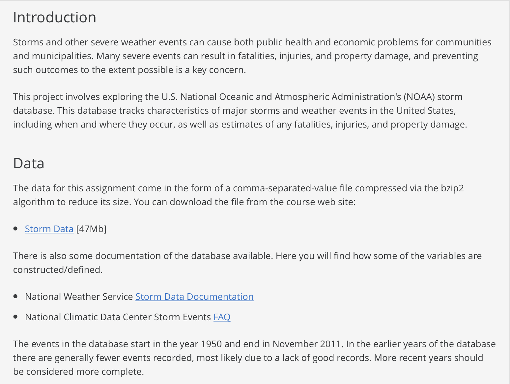

#### Preface 

* When you have completed the assignment, knit the R Markdown, commit your changes and push to GitHub.
* You are welcome and encouraged to discuss homework problems with others in order to better understand it, but the work you turn in must be your own. You must write your own code, data analyses, and communicate and explain the results in your own words and with your own visualizations. **All students turning in plagiarized solutions will be reported to Office of Academic Integrity, and will fail the assignment**.

# Motivation 

An important part of data science is being able to evaluate data analyses and data analytic products. In this homework assignment you will practice this skill by comparing and contrasting data analyses and coming up with your own rubic for evaluating the analyses. 

There are two parts to this homework assignment each with different due dates: 

* Part 1 is due **Friday September 13, 2019 at 11:59 PM**. Write down your answer in this R Markdown document, knit the R Markdown, commit your changes, and push to GitHub, but you also need to submit your answer to this [google form](https://forms.gle/qDg7u6vP6wPVS7b89) by the due date. We will release Part 2 on **Saturday September 14, 2019 at 12:01 AM**. 
* Part 2 is due **Wednesday September 18, 2019 at 11:59 PM**. When you have completed the assignment, knit the R Markdown, commit your changes and push to GitHub.


## Part 1

Here is a prompt that includes a brief introduction to the U.S. National Oceanic and Atmospheric Administration's (NOAA) storm database. 

```{r out.width = "80%", echo = FALSE, fig.align='center'}

```

Assume two data analysts have been given the same prompt above and you are the audience who will evaluate the two analyses. Assume you do not have access to the database itself until you see the data analyses. Create a rubric that you would use to evaluate the data analyses.

**Helpful hints**: 

The rubric needs to include: 

* A bulleted list of objective characteristics (or _data analysis principles_) that are important to you as the audience. (**Note**: you can include characteristics outside the six principles that we discussed in class if you believe that they are **objective characteristics** about data analyses). The total number of data analysis principles ($N$) can be as long as you wish, but it must include at least four (i.e. $N \geq 4$). 

For each data analysis principle ($i$), include:

* 1-2 sentences describing why you are interested in these _principles_ as an audience. If a listed principle is outside the six principles discussed in class, you also need to describe why you think they are **objective** characteristics. 
* A weight $w_i \in [0, 1]$ that represents how important this principle is in your rubric. The weights for each principle should sum to 1 (i.e. $\sum_i w_i  = 1$). For example, if you include _reproducibility_ in your rubric and reproduciblity is not very important to you, you might assign it a small weight. 

**Note**: You could just exclude reproduciblity entirely from your rubric (e.g. this is a principle that you as an audience are ambivalent about and it does not factor into your evaluation of the data analyses). Alternatively, you could include it in your rubric, but intentionally downweight the importance of reproducibility by giving it a small weight (e.g. maybe analyzing the data as fast as possible is your priority and you do not want the analyst wasting time on making it reproducible). These are **two different approaches** that you should carefully think about when building your rubric. 

**Note**: Part 1 is due **Friday September 13, 2019 at 11:59 PM**. Write down your answer in this R Markdown document, knit the R Markdown, commit your changes, and push to GitHub, but you also need to submit your answer to this [google form](https://forms.gle/qDg7u6vP6wPVS7b89) by the due date. We will release Part 2 on **Saturday September 14, 2019 at 12:01 AM**. 

#### Add your answer here


## Part 2

On Saturday September 14, 2019 at 12:01 AM we will release the links to the two data analyses by sending the links on Slack. 

### Part 2.1

In this part, apply the rubric you built in Part 1 to the two data analyses. 

For a given data analysis and for each data analysis principle ($i$) in your rubric: 

* Give an integer score $S_i \in [0, 10]$ that represents how much the given data analysis exhibits this principle where 0 is low and 10 is high. For example if the principle is _reproduciblity_, give a score between 0 and 10 on how reproducible individual parts or the overall analysis (up to you) is where 0 is not reproducible and 10 is reproducible. 

Next, create a data frame containing four columns: For a given analysis, each row should contain the `data_analysis` (Column 1) that you are evaluating, the data analysis `principle` (Column 2), the `weight` (Column 3) associated with each principle, and the `score` (Column 4) used in your rubric for each analysis. For example, if there were only two principles in the rubric, an example of the data frame could look like this: 

```{r}
rubric <- data.frame(data_analysis = rep(paste("analysis", 1:2, sep="_"), each = 2),
                     principle = rep(c("reproducbility", "exhaustive"),2),
                     weight = rep(c(0.1, 0.9), 2),
                     score = c(10, 4, 2, 6))
rubric
```

Once you have completed this, think about and make specific suggestions on how could the two analyses could be improved (e.g. what changes could be made to make it better from the perspective of you being the audience and your rubric)? 

#### Add your answer here


## Part 2.2

In this part, answer the following questions: 

1. Now that you have evaluated the analyses with your rubric, in your opinion, what problem do you think the data analysts who developed the two analyses are addressing or solving? (Note: they could be different problems / goals for each analysis). 
2. What type of question is being asked (e.g. predictive, causal, inference)? What evidence do you have to support this?  
3. What audience do you think the two data analysts built the analyses for? 
4. Using the principles in your rubic, compare and contrast the differences between the two analyses. Describe in words what are the similarities or differences. Give examples of _data analytic elements_ that are used in the data analyses to support your argument. 

#### Add your answer here


## Part 2.3 

In this part, we will now introduce two different audiences. Instead of assuming you are the audience, let's assume there are two new (but different) audiences: 

1. The head of the United States [Environmental Protection Agency](https://www.epa.gov) (EPA). This is an independent agency of the United States federal government with a goal of protecting the environment. 

2. A potential homebuyer who is interested in purchasing a house along the coast in the state of Florida. 

Reflecting on these new audiences: 

1. Modify the rubric to reflect the principles and weights that these audiences might be interested in. We know you are unlikely to be either of these audiences, but use your best judgement to make an educated guess. The principles themselves and the number of principles can change between audiences, but again there must be at least $N \geq 4$ for each audience. 
2. For each principle, give 1-2 sentences describing why these audiences might be care about these same (or different?) _principles_ that you have now included for each audience.
3. Give a score for each principle you include in the rubric for each data analysis and audience. 
4. Once you have completed this, think about and make specific suggestions on how could the two analyses could be improved (e.g. what changes could be made to make it better from the perspective of the new audience members)? Keep in mind, you might make different suggestions for each of the two audiences. 

Update the data frame you created above to include this new information. Include a new column called `audience` corresponding to which audience is evaluating the data analyses. For example, if there were only two principles included in rubric that all three audiences cared about, this is an example of what the data frame might look like 

```{r}
final_rubric <- data.frame(data_analysis = rep(paste("analysis", 1:2, sep="_"), each = 6),
                     audience = rep(rep(c("me", "EPA", "homebuyer"), each = 2), 2),
                     principle = rep(c("reproducbility", "exhaustive"),6),
                     weight = rep(c(0.1, 0.9), 6),
                     score = c(10, 4, 2, 6, 1, 9, 4, 3, 4, 5, 8, 4))
final_rubric
```


Save this data frame to `.csv` file in your github repo with the title `711-HW1-scores-<yourlastname>.csv` where you replace `<yourlastname>` with your last name. 

```{r, eval = FALSE}
readr::write_csv(final_rubric, path = "711-HW1-scores-<yourlastname>.csv")
```

#### Add your answer here


# Reminder 

There are two parts to this homework assignment each with different due dates: 

* Part 1 is due **Friday September 13, 2019 at 11:59 PM**. Write down your answer in this R Markdown document, knit the R Markdown, commit your changes, and push to GitHub, but you also need to submit your answer to this [google form](https://forms.gle/qDg7u6vP6wPVS7b89) by the due date. We will release Part 2 on **Saturday September 14, 2019 at 12:01 AM**. 
* Part 2 is due **Wednesday September 18, 2019 at 11:59 PM**. When you have completed the assignment, knit the R Markdown, commit your changes and push to GitHub.
