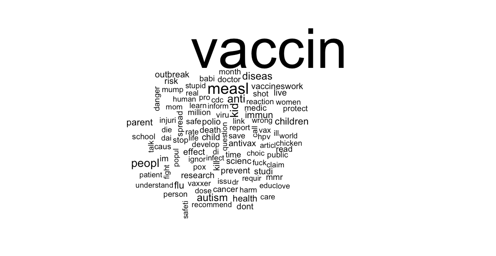

```{r setup, include=FALSE, warnings=FALSE}
knitr::opts_chunk$set(echo = TRUE)
```

#### Preface 

* **This homework is due Wednesday September 25, 2019 at 11:59 PM**. 
* When you have completed the assignment, knit the R Markdown, commit your changes and push to GitHub.
* If you do not include axis labels and plot titles, then points will be deducted.
* You are welcome and encouraged to discuss homework problems with others in order to better understand it, but the work you turn in must be your own. You must write your own code, data analyses, and communicate and explain the results in your own words and with your own visualizations. **All students turning in plagiarized solutions will be reported to Office of Academic Integrity, and will fail the assignment**.

# Motivation

Vaccines have faced criticism from the beginning of development.
However, recently in the United States and around the world, 
vaccination has faced increasing skepticism and vaccination rates
have begun to decline. Anti-vaccination rhetoric is especially
prevalent on social media where platforms serve as an open space 
for misinformation to spread.

The goal of this homework is to download Twitter data in preparation 
for being able to identify tweets as "pro" or "anti" vaccination (e.g.
identify Twitter users and tweets that are "anti-vaccination." or e.g. 
identify the sentiment of tweets). Tweets often have an associated 
location, thus this would allow researchers to locate communities 
where anti-vaccination sentiment is growing. This could help
healthcare professionals identify communities that are at 
higher risk of infectious diseases.

```{r out.width = "100%", echo = FALSE, fig.align='center'}

```

Some R packages that you might helpful are the packages in the
`tidyverse` and the `rtweet` package. The latter is needed to 
download the Twitter data, but you will need to
sign up for a Twitter developer account, create an application,
and enter your own keys & credentials (for more information on 
this see Problem 1).

# Problem 1

Using the `rtweet` package, search for the 5,000 most recent
tweets that contain the terms "antivax", "provax", "vaccineswork", 
"vaccinesdontwork", or "vaccines" using the `search_tweets()` 
function, excluding retweets, and only including tweets in 
English. 

**Helpful hints**: To help you get started with the `rtweet`
package, you will need to sign up for a 
[Twitter developer account](https://developer.twitter.com/en/apply-for-access.html),
[create an application](https://rtweet.info/articles/auth.html), authenticate using a [web-browser](https://rtweet.info/articles/auth.html#browser-based-authentication) or [access token/secret method](https://rtweet.info/articles/auth.html#access-tokensecret-method). Note that we have set the code chunk 
`eval=FALSE` so it is ignored when this file is knit.

```{r eval=FALSE}
library(rtweet)

twitter_token <- create_token(
  app = "twitter_app_name",
  consumer_key = "XXXXXXXXXXXXXXX",
  consumer_secret = "XXXXXXXXXXXXXXXXXXXXX",
  access_token = "XXXXXXXXXXXXXXXXXXXXXXXXXXX",
  access_secret = "XXXXXXXXXXXXXXXXX")
```

Once the `twitter_token` is created it is stored in the
workspace and you are free to use all the functions in `rtweet`.

```{r, eval=FALSE}
## add your code here

```


# Problem 2

What data exists in the results from Problem 1? 

#### Add your answer here


Add any other additional information that you can to the data. 
Explore the `rtweet` package for other possible functionality 
(or other data sources). Think about if you were creating this 
dataset for someone else, you might want to include more 
information than you would need for your own analysis. 
What other types of information can you include? What other 
information did you include? Think broadly. 

```{r, eval=FALSE}
## add your code here

```

#### Add your answer here


# Problem 3

After collecting the tweets with the `rtweet` package, 
save the data as a `.csv` file called `twitter_data.csv` 
using the `readr` package. Save the `.csv` in your GitHub 
repo and make sure you include when you push your changes. 

We set the code chunks above to 
`eval=FALSE` so that when you knit this document, you will not 
access the API each time you knit. Also, this is an important 
step because the data you collect with the API can be very
different every time. Finally, it takes a few minutes to 
download new tweets, so we don't want to wait each time we knit.

```{r, eval=FALSE}
## add your code here

```

**Note**: You may have to deal columns that contained e.g. 
lists because they are not compatible for export. 


# Problem 4 

Keeping in mind the original goal, 

> The goal of this homework is to download Twitter data in preparation 
for being able to identify tweets as "pro" or "anti" vaccination (e.g.
identify Twitter users and tweets that are "anti-vaccination."). 
Tweets often have an associated location, thus this would allow 
researchers to locate communities where anti-vaccination sentiment 
is growing. This could help healthcare professionals identify 
communities that are at higher risk of infectious diseases.

and using the dataset that you have now created, create a data 
analysis plan. Describe **in great detail** what you will need 
to do in terms of data tidying, wrangling, exploratory data analysis, 
data visualization and any modeling / analyses that you would like to 
complete to accomplish the goal above. Explore the data a 
bit (e.g. plots or other forms of exploratory data analyses) 
to help you understand what format the data are currently in 
and how to get it to the format you will need to complete your
data analysis plan. Clearly state who your target audience is and 
think carefully about what audience you have in mind as you build
your data analysis plan. 

**Note**: As you formulate and write up your data analysis plan, 
you might realize that you need to go back to Problem 2 to add any
other additional information that you need to complete your data 
analysis. Iterate until you are happy with both the data you gathered 
and your data analysis plan. 

```{r, eval=FALSE}
## add your code here

```


#### Add your answer here

